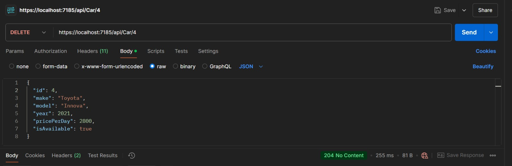

# Car Rental System


The **Car Rental System** is a backend service built using C# and .NET Core for managing a fleet of rental cars. It includes functionalities for user management, car booking, availability checks, rental history, and user notifications. The system is built using Entity Framework (EF) and follows best practices for building RESTful APIs.

---

## Features

1. **Car Management**
   - Add, update, and delete cars in the system.
   - Check car availability and manage their rental status.

2. **User Management**
   - Register users and manage user roles (Admin or User).
   - Authenticate users and provide JWT tokens for secure API access.

3. **Car Rentals**
   - Book cars and calculate rental costs.
   - Notify users of successful bookings via email.

4. **Authentication & Authorization**
   - Secure endpoints using JWT tokens.
   - Role-based authorization to restrict certain actions to admins only.

5. **Validation**
   - Input validation for creating and updating cars or users using data annotations.

---

## Tasks and Implementation

### 1. Models
- **Car Model**: 
  - Properties: `Id`, `Make`, `Model`, `Year`, `PricePerDay`, `IsAvailable`.
- **User Model**: 
  - Properties: `Id`, `Name`, `Email`, `Password`, `Role` (Admin/User).

### 2. Services
- **Car Rental Service**:
  - Methods: `RentCar`, `CheckCarAvailability`.
- **User Service**:
  - Methods: `RegisterUser`, `AuthenticateUser` (returns JWT token).

### 3. Repositories
- **Car Repository**:
  - Methods: `AddCar`, `GetCarById`, `GetAvailableCars`, `UpdateCarAvailability`.
- **User Repository**:
  - Methods: `AddUser`, `GetUserByEmail`, `GetUserById`.

### 4. API Filters for Validation
- Input validation for models using data annotations (e.g., `[Required]`, `[EmailAddress]`).

### 5. Middlewares
- Middleware for validating JWT tokens and handling unauthorized access.

### 6. Controllers for CRUD Operations
- **Car Controller**:
  - `GET /cars`: Get a list of available cars.
  - `POST /cars`: Add a new car to the fleet (Admin only).
  - `PUT /cars/{id}`: Update car details and availability.
  - `DELETE /cars/{id}`: Delete car details.
- **User Controller**:
  - `POST /users/register`: Register a new user.
  - `POST /users/login`: Login and receive a JWT token.

### 7. Notification Handling System
- Email notifications for successful car bookings using a service like SendGrid.

### 8. Authentication and Authorization using JWT
- Users receive a JWT token upon login.
- Role-based authorization for securing endpoints.
- Admin-exclusive functionalities for managing cars.

### 9. Testing using Postman
- Postman collections for testing API endpoints:
  - User registration and login (with JWT token retrieval).
  - Viewing available cars and booking them.
  - Admin functionalities for managing cars.

---

## Tools and Technologies
- **C#** and **.NET Core** for API development.
- **Entity Framework Core** for database management.
- **JWT** for authentication and authorization.
- **SendGrid** (or equivalent) for email notifications.

---


#### 1. Register a New User
- **URL**: `POST /users/register`
- **Description**: Registers a new user.
- **Headers**: None
- **Sample Payload**:
```json
{
  "name": "John Doe",
  "email": "johndoe@example.com",
  "password": "password123",
  "role": "User"
}
```
- **Response**: 


#### 2. Login
- **URL**: `POST /users/login`
- **Description**: Logs in a user and provides a JWT token.
- **Headers**: None
- **Sample Payload**:
```json
{
  "email": "johndoe@example.com",
  "password": "password123"
}
```
- **Response**: 


### Car Endpoints

#### 1. Get Available Cars
- **URL**: `GET /cars`
- **Description**: Fetches a list of all available cars.
- **Headers**: 
  - `Authorization: Bearer <JWT_TOKEN>`
- **Sample Response**:


#### 2. Add a New Car (Admin Only)
- **URL**: `POST /cars`
- **Description**: Adds a new car to the fleet.
- **Headers**: 
  - `Authorization: Bearer <JWT_TOKEN>`
- **Sample Payload**:
```json
{
  "make": "Honda",
  "model": "Civic",
  "year": 2022,
  "pricePerDay": 60,
  "isAvailable": true
}
```
- **Response**:


#### 3. Update Car Details (Admin Only)
- **URL**: `PUT /cars/{id}`
- **Description**: Updates details of an existing car.
- **Headers**: 
  - `Authorization: Bearer <JWT_TOKEN>`
- **Sample Payload**:
```json
{
  "make": "Honda",
  "model": "Civic",
  "year": 2023,
  "pricePerDay": 65,
  "isAvailable": true
}
```
- **Response**:


#### 4. Delete a Car (Admin Only)
- **URL**: `DELETE /cars/{id}`
- **Description**: Deletes a car from the fleet.
- **Headers**: 
  - `Authorization: Bearer <JWT_TOKEN>`
- **Response**:


### Rental Endpoints

#### Rent a Car
- **URL**: `POST /cars/rent`
- **Description**: Books a car for rental.
- **Headers**: 
  - `Authorization: Bearer <JWT_TOKEN>`
- **Sample Payload**:
```json
{
  "carId": 1,
  "userId": 2,
  "rentalDuration": 3
}
```
- **Response**:

- 

---
